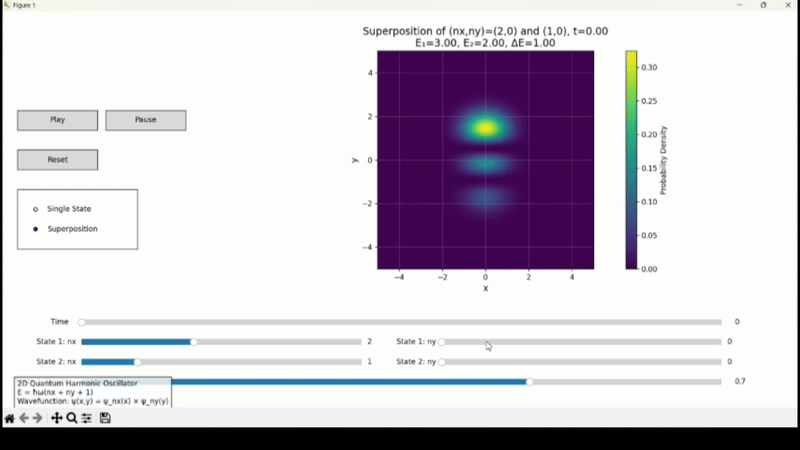

# 2D Quantum Harmonic Oscillator Visualizer

An interactive visualization of quantum mechanical states in a two-dimensional harmonic oscillator potential, demonstrating fundamental concepts of quantum mechanics through beautiful wave function animations.



## Physics Background

### The Quantum Harmonic Oscillator

The quantum harmonic oscillator is one of the most important model systems in quantum mechanics, appearing in various physical contexts from vibrating molecules to quantum optics. In classical mechanics, a harmonic oscillator is simply a system that experiences a restoring force proportional to its displacement from equilibrium (think of a mass on a spring). The quantum version exhibits fascinating features that highlight the wave-like nature of matter at the microscopic scale.

### Key Quantum Mechanical Concepts

1. **Wave Functions (ψ)**: In quantum mechanics, the state of a system is described by a wave function. For the 2D harmonic oscillator, the wave function ψ(x,y) gives us information about where we're likely to find a particle in the (x,y) plane.

2. **Probability Density (|ψ|²)**: The square of the magnitude of the wave function, |ψ|², represents the probability density of finding the particle at a particular position.

3. **Energy Quantization**: The energy of the oscillator can only take certain discrete values:
   E = ℏω(nx + ny + 1)
   where:
   - ℏ (h-bar) is the reduced Planck constant
   - ω is the angular frequency
   - nx and ny are non-negative integers (quantum numbers)

4. **Quantum Superposition**: The program can show superpositions of different energy eigenstates, demonstrating one of the most profound features of quantum mechanics.

## Program Features

This interactive visualization allows users to:

- View probability density plots for different quantum states
- Switch between single states and superpositions
- Animate time evolution of quantum states
- Adjust quantum numbers (nx, ny) in real-time
- Control superposition weights between states
- Play, pause, and reset time evolution

### Controls

- **Single State Mode**:
  - Sliders for nx and ny quantum numbers
  - Time evolution control
  
- **Superposition Mode**:
  - Independent control of two quantum states (nx1, ny1) and (nx2, ny2)
  - Adjustable weighting between states
  - Time evolution of the superposition

## Technical Implementation

The program uses several key Python libraries:
- `numpy` for numerical computations
- `scipy.special` for Hermite polynomials
- `matplotlib` for visualization and interactive elements

The wave functions are constructed using:
1. Hermite polynomials (the spatial part of the solution)
2. Gaussian functions (the exponential decay terms)
3. Appropriate normalization factors

For superpositions, the program combines states with appropriate time-dependent phase factors:
ψ(x,y,t) = c₁ψ₁(x,y)e^(-iE₁t/ℏ) + c₂ψ₂(x,y)e^(-iE₂t/ℏ)

## Requirements

```python
numpy
matplotlib
scipy
```

## Usage

Run the program using:
```bash
python test.py
```

## Mathematical Details

The 2D quantum harmonic oscillator wave function is a product of two 1D wave functions:
ψ(x,y) = ψₙₓ(x) × ψₙᵧ(y)

where each 1D wave function is given by:
ψₙ(x) = (1/√(2ⁿn!√π)) × Hₙ(x) × e^(-x²/2)

Hₙ(x) represents the nth Hermite polynomial.

## License

This project is open source and available under the MIT License.

## Author

Jonathan Maynard

## Acknowledgments

This project was created to demonstrate fundamental quantum mechanical principles in an interactive and visually appealing way. It serves as both an educational tool and a demonstration of the beautiful patterns that emerge from quantum mechanics. 