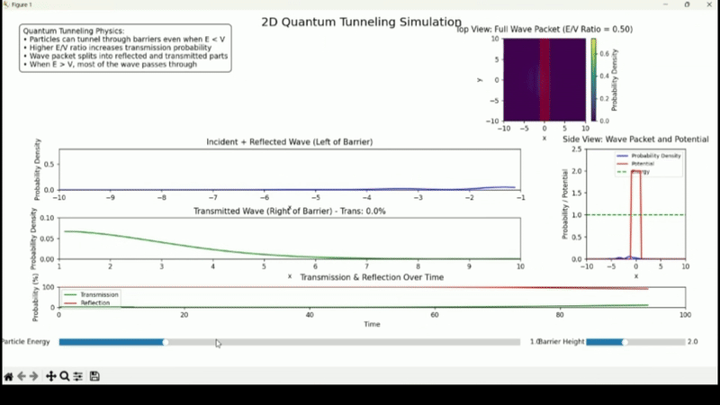

# 2D Quantum Tunneling Through Potential Barrier

An interactive visualization demonstrating quantum tunneling phenomena in two dimensions, showing how quantum particles can penetrate barriers that would be impenetrable in classical physics.



## Physics Background

### Quantum Tunneling

Quantum tunneling is a quantum mechanical phenomenon where particles pass through a potential energy barrier that they classically could not surmount. This is a direct consequence of the wave-like properties of matter at the quantum scale and demonstrates one of the most counterintuitive aspects of quantum mechanics.

### Key Quantum Mechanical Concepts

1. **Wave Functions (ψ)**: The quantum state of a particle is described by its wave function, which in this simulation represents a wave packet that evolves in time and space.

2. **Probability Density (|ψ|²)**: The square of the magnitude of the wave function gives the probability density of finding the particle at a particular position.

3. **Barrier Penetration**: When a quantum wave packet encounters a potential barrier, part of it is reflected, but a portion of the wave can "tunnel" through the barrier - something impossible in classical physics.

4. **Wave Packet Dynamics**: The simulation shows how a localized wave packet spreads out over time while interacting with potential barriers.

## Program Features

This visualization allows users to:

- Observe the time evolution of a wave packet in 2D
- See quantum tunneling through potential barriers
- Visualize probability densities in real-time
- Adjust parameters controlling the simulation

## Technical Implementation

The program uses several Python libraries:
- `numpy` for numerical computations
- `matplotlib` for visualization and animation
- Advanced numerical techniques for solving the time-dependent Schrödinger equation in 2D

The simulation employs a split-step Fourier method to solve the time-dependent Schrödinger equation efficiently in two dimensions.

## Requirements

```python
numpy
matplotlib
scipy
```

## Usage

Run the program using:
```bash
python test.py
```

## Mathematical Details

The time evolution of the quantum system is governed by the time-dependent Schrödinger equation:

iℏ∂ψ(x,y,t)/∂t = [-ℏ²/2m)(∂²/∂x² + ∂²/∂y²) + V(x,y)]ψ(x,y,t)

where:
- ψ(x,y,t) is the 2D wave function
- ℏ is the reduced Planck constant
- m is the particle mass
- V(x,y) represents the potential barrier

## License

This project is open source and available under the MIT License.

## Author

Jonathan Maynard 