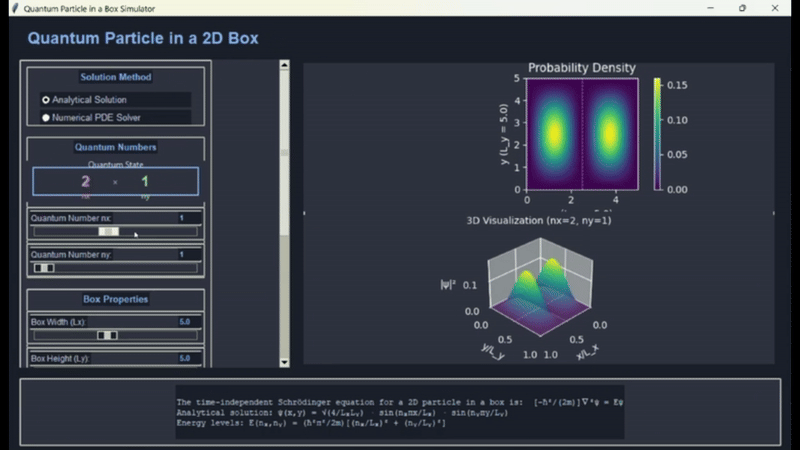

# Hamiltonian Matrix for a 2D Infinite Square Well

A computational visualization of energy eigenstates for a particle confined in a two-dimensional infinite square well potential, demonstrating quantum mechanical behavior through Hamiltonian matrix diagonalization.



## Physics Background

### The Infinite Square Well

The infinite square well (or particle in a box) is a fundamental quantum mechanical model describing a particle confined to a finite region of space with impenetrable boundaries. The 2D version extends this concept to a particle confined in a rectangular area with infinitely high potential walls.

### Key Quantum Mechanical Concepts

1. **Hamiltonian Matrix**: The Hamiltonian operator represents the total energy of the system. When expressed in matrix form, diagonalizing it yields the energy eigenvalues and eigenstates of the system.

2. **Energy Quantization**: The confinement of the particle leads to discrete energy levels, a fundamental quantum mechanical phenomenon.

3. **Wave Functions (ψ)**: The eigenstates of the Hamiltonian represent the possible quantum states of the particle, with characteristic spatial probability distributions.

4. **Probability Density (|ψ|²)**: The square of the magnitude of the wave function gives the probability density of finding the particle at a particular position.

## Program Features

This visualization demonstrates:

- Construction and diagonalization of the Hamiltonian matrix
- Visualization of energy eigenstates in a 2D infinite square well
- Probability density plots for various quantum states
- Nodal patterns characteristic of 2D quantum confinement
- Energy level structure and degeneracies

## Technical Implementation

The program implements:
- Numerical construction of the Hamiltonian matrix
- Efficient matrix diagonalization using `numpy.linalg`
- High-quality visualization of quantum states
- Interactive display of energy levels and eigenfunctions

## Requirements

```python
numpy
matplotlib
scipy
```

## Usage

Run the program using:
```bash
python test.py
```

## Mathematical Details

For a 2D infinite square well with dimensions L₁ × L₂, the energy eigenvalues are:

E_{n₁,n₂} = (π²ℏ²/2m)[n₁²/L₁² + n₂²/L₂²]

where n₁ and n₂ are positive integers.

The corresponding wave functions are:

ψ_{n₁,n₂}(x,y) = (2/√(L₁L₂)) sin(n₁πx/L₁) sin(n₂πy/L₂)

The program constructs and diagonalizes the Hamiltonian matrix in a finite basis to obtain accurate approximations of these states, particularly useful for more complex potentials.

## License

This project is open source and available under the MIT License.

## Author

Jonathan Maynard 