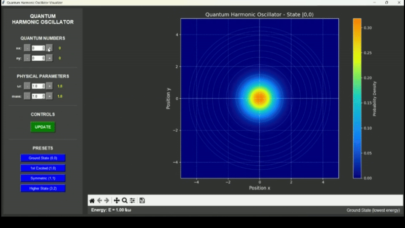

# Quantum Harmonic Oscillator

A visualization of the one-dimensional quantum harmonic oscillator, showing energy eigenstates, probability densities, and time evolution of quantum states.



## Physics Background

### The Quantum Harmonic Oscillator

The quantum harmonic oscillator is one of the most important and foundational systems in quantum mechanics. It describes a particle moving in a quadratic potential well (V(x) = ½kx²) and serves as a model for many physical phenomena, from molecular vibrations to quantum field theories.

### Key Quantum Mechanical Concepts

1. **Energy Quantization**: Unlike classical oscillators, the energy of a quantum harmonic oscillator is quantized according to:
   E_n = ℏω(n + ½) where n = 0, 1, 2, ...

2. **Wave Functions (ψ)**: Each energy eigenstate has a specific wave function ψ_n(x) that determines the probability amplitude of finding the particle at position x.

3. **Zero-Point Energy**: Even in the ground state (n=0), the oscillator possesses non-zero energy (E₀ = ½ℏω), demonstrating the uncertainty principle.

4. **Probability Density (|ψ|²)**: The probability of finding the particle at a given position is proportional to |ψ|², which for the harmonic oscillator shows interesting patterns based on quantum number n.

## Program Features

This visualization demonstrates:

- Energy eigenstates of the quantum harmonic oscillator
- Probability density distributions for different quantum states
- Time evolution of pure states and superpositions
- Relationship between classical turning points and probability density
- Comparison between classical and quantum behavior

## Technical Implementation

The program uses:
- `numpy` for numerical calculations
- `matplotlib` for interactive visualization
- `scipy.special` for Hermite polynomial evaluation (used in the wave functions)

The wave functions are calculated using:
ψ_n(x) = (1/√(2^n n! √π)) × H_n(√(mω/ℏ)x) × e^(-mωx²/2ℏ)

where H_n represents the nth Hermite polynomial.

## Requirements

```python
numpy
matplotlib
scipy
```

## Usage

Run the program with:
```bash
python test.py
```

## Mathematical Details

The 1D quantum harmonic oscillator is described by the Hamiltonian:
H = p²/2m + ½mω²x²

The time-independent Schrödinger equation:
(-ℏ²/2m d²/dx² + ½mω²x²)ψ(x) = Eψ(x)

has solutions in terms of Hermite polynomials for the energy eigenstates.

## License

This project is open source and available under the MIT License.

## Author

Jonathan Maynard 